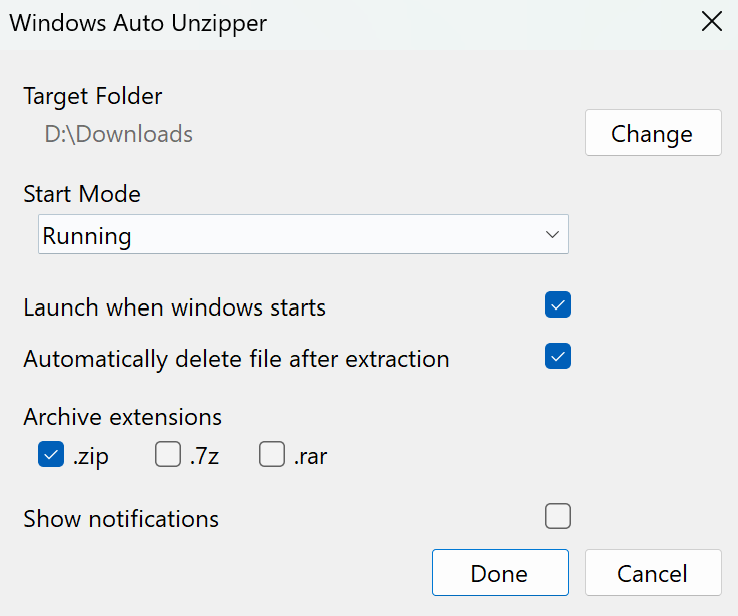

# Windows Auto Unzipper

Automatically extracts new archives from a selected folder in the background.

Windows Auto Unzipper runs from the system tray, watches a target folder such as Downloads, and extracts supported archives when they finish downloading.

## Features

- Watch any selected folder for new archives
- Extract `.zip`, `.7z`, and `.rar` files
- Choose supported archive types with checkboxes in Settings
- Use `.zip` as the default enabled archive type
- Wait until a downloaded archive is complete before extracting it
- Automatically delete the source archive after extraction
- Start with Windows from the system tray
- Start or stop watching from the tray menu
- Show or hide tray notifications, disabled by default
- Open the watched folder from the tray menu
- See the last extraction result in the tray menu

## Requirements

Building the project requires the .NET 8 SDK on Windows.

Running the published release does not require installing .NET when it is built as a self-contained single-file executable.

## Build

For a regular development build:

```powershell
dotnet restore
dotnet build .\WindowsAutoUnzipper.sln -c Release
```

## Publish One EXE

The project is configured to publish a Windows x64, self-contained, single-file executable.

```powershell
dotnet publish ".\Windows Auto Unzipper\WindowsAutoUnzipper.csproj" -c Release
```

The output is created under:

```text
Windows Auto Unzipper\bin\Release\net8.0-windows\win-x64\publish\
```

You can distribute `WindowsAutoUnzipper.exe` from that folder as a standalone app.

## Settings

- `Target Folder`: folder to watch for downloaded archives
- `Start Mode`: run, stop, or remember the previous session state
- `Launch when Windows starts`: register or remove the app from Windows startup
- `Automatically delete file after extraction`: remove the archive after successful extraction
- `Archive extensions`: enable `.zip`, `.7z`, and/or `.rar`
- `Show notifications`: enable tray balloon notifications

## Notes

The app waits for archive files to stop changing and become unlocked before extraction. This avoids false errors while a browser or download manager is still writing the file.

## Screenshots


